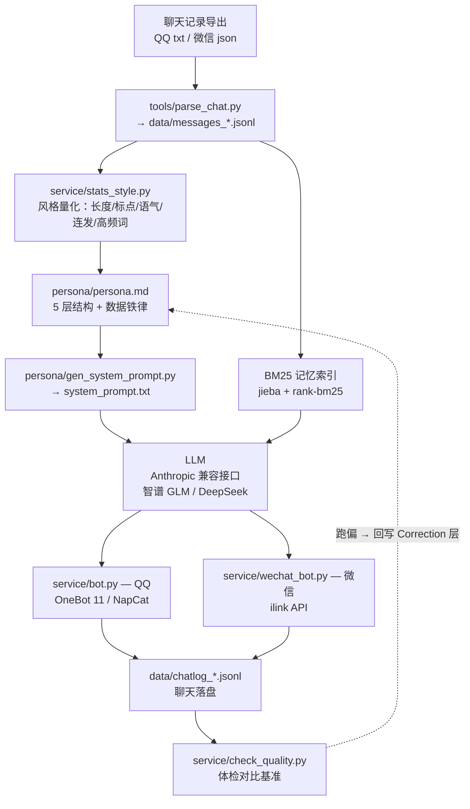

# rememory

把一段亲密关系里的**说话方式**蒸馏成一个 AI 聊天机器人，部署到 QQ / 微信，说话风格和那个人高度一致、几乎没有"AI 感"。

这个项目不提供任何真实人物的人设——它给你一套**方法论 + 工具链**：从导出的聊天记录出发，量化出那个人的说话风格，写进 persona，再挂到 QQ / 微信上跑起来。

> ⚠️ **隐私与伦理提醒**：这个项目会处理高度私密的聊天记录。请只对你**有权使用、且对方知情或已同意**的数据使用。切勿把含真人隐私的人设、聊天记录或密钥提交到公开仓库。

---

## 它解决了什么问题

普通的"角色扮演"机器人会露出明显的 AI 腔：长句、书面语、每句带语气词、客服式回应。根本原因是**用"感觉"去写人设，而不是用"数据"去写**。

rememory 的核心是**数据铁律**：

1. 先从真实聊天记录里**统计**那个人的说话特征——消息长度中位数、短句占比、句尾标点率、语气词频率、连发模式、高频词、口头禅。
2. 把这些数字**写进 persona**，作为硬约束交给模型。
3. 机器人上线后持续**落盘 + 体检**，用同一套指标对比偏差，发现问题就回写 persona 修正。

结果就是：机器人说出来的话，在统计分布上接近真人。

---

## 架构



## 目录结构

```
rememory/
├── README.md
├── requirements.txt
├── .env.example              # 密钥/账号模板，复制为 .env
├── docs/
│   ├── persona-framework.md  # 5 层 persona 怎么写（核心方法论）
│   ├── deploy-qq.md          # QQ 部署
│   └── deploy-wechat.md      # 微信部署
├── service/
│   ├── common.py             # 配置/密钥加载
│   ├── bot.py                # QQ 机器人
│   ├── wechat_bot.py         # 微信机器人
│   ├── check_quality.py      # 质量体检
│   ├── stats_style.py        # 风格量化
│   ├── rebuild_index.py      # 重建记忆索引 + 自测
│   └── start/restart_wechat_bot.bat(.vbs)
├── tools/
│   ├── parse_chat.py         # QQ txt → jsonl
│   └── build_persona.py      # 提取人设素材 + 抽样
└── persona/
    └── gen_system_prompt.py  # persona.md → system_prompt.txt
```

---

## 快速开始

### 0. 准备

```bash
pip install -r requirements.txt
cp .env.example .env      # 填入你的 LLM key、QQ 号、微信 token
```

依赖：Python 3.9+，以及一个**Anthropic 兼容接口**的模型服务（智谱 GLM、DeepSeek 等；只需 `LLM_API_KEY` + `LLM_BASE_URL`）。

### 1. 导出并解析聊天记录

- QQ：用消息管理器导出 txt，`python tools/parse_chat.py 某人(QQ号).txt --label qjh --out data/messages_qjh.jsonl`
- 微信：用 WeChatMsg / echotrace 等工具导出后自行转成同样的 jsonl 格式（每行 `{"time","sender","text"}`）

### 2. 量化说话风格

```bash
python service/stats_style.py data/messages_qjh.jsonl --her 她的名字 --him 你的名字
```

记下这些数字：长度中位数、≤6 字占比、句尾无标点占比、语气词结尾占比、连发模式、高频词/口头禅。

### 3. 写 persona

照 [docs/persona-framework.md](docs/persona-framework.md) 的 5 层结构，把第 2 步的统计数字写进"表达风格"层。存为 `persona/persona.md`。

```bash
python persona/gen_system_prompt.py     # 生成 persona/system_prompt.txt
```

### 4. 先本地试聊

```bash
cd service
python bot.py --cli      # 命令行里先聊几句，看风格对不对
```

### 5. 部署到 QQ / 微信

- QQ：见 [docs/deploy-qq.md](docs/deploy-qq.md)（需要 NapCat + OneBot 11）
- 微信：见 [docs/deploy-wechat.md](docs/deploy-wechat.md)（需要微信对话开放平台 bot token）

### 6. 持续调优

聊一段时间后：

```bash
python service/check_quality.py
```

它会用基准指标体检机器人的回复，提示哪里跑偏（太长/语气词超标/AI 腔词）。发现问题就回写 persona 的 **Correction 层**，重新生成、重启。

---

## 为什么能做到"不像 AI"

- **数据驱动的风格约束**：不用形容词（"她说话很可爱"），只用数字（"60% 的消息 ≤6 字"）。模型能精确执行数字，执行不了形容词。
- **Correction 层**：persona 里预留了最高优先级的一层，专门记"她不会这样"，比任何性格描述都优先。
- **连发拆分**：回复按真人连发模式拆成多条短消息（每条 ≤20 字），而不是一条长消息。
- **兜底去固定化**：LLM 偶发失败时，用随机短句兜底，而不是一句固定的机器人话。
- **记忆检索**：历史聊天用 BM25 召回，涉及具体事实时以真实记录为准，不编造。

---

## 已知限制

- QQ 侧依赖 NapCat 本地登录 QQ 号，**绑死本机**（异地登录有封号风险），不能像微信那样搬云。
- 微信侧 `wechat_bot.py` 里的 ilink 协议字段（`bot_agent` 等）来自逆向，接口变动可能需要重新适配。
- 效果上限取决于导出的聊天记录质量和模型本身的中文口语能力。

## License

[MIT](LICENSE)
